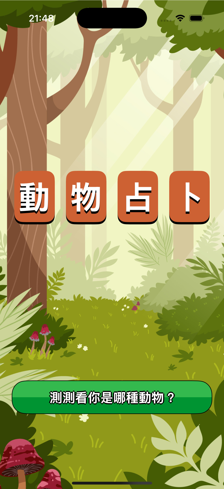
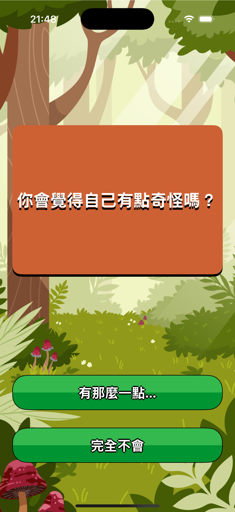
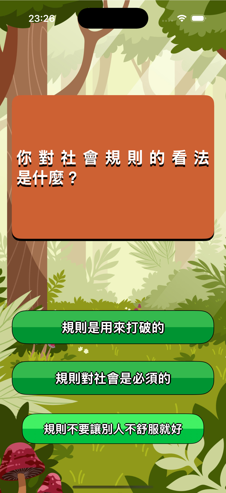
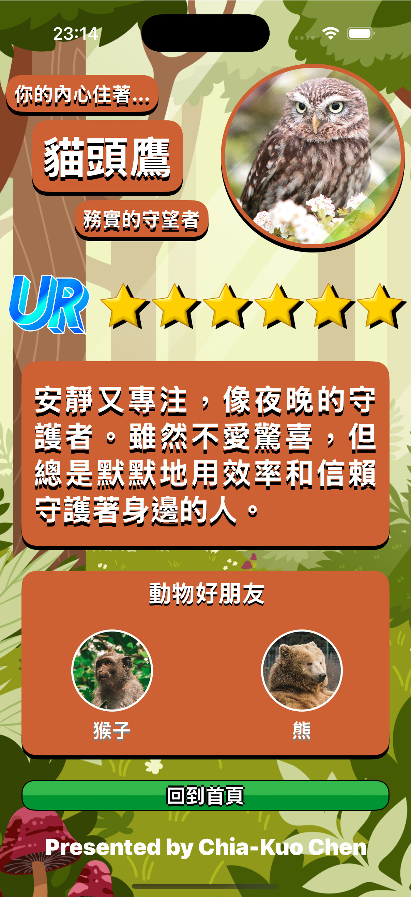
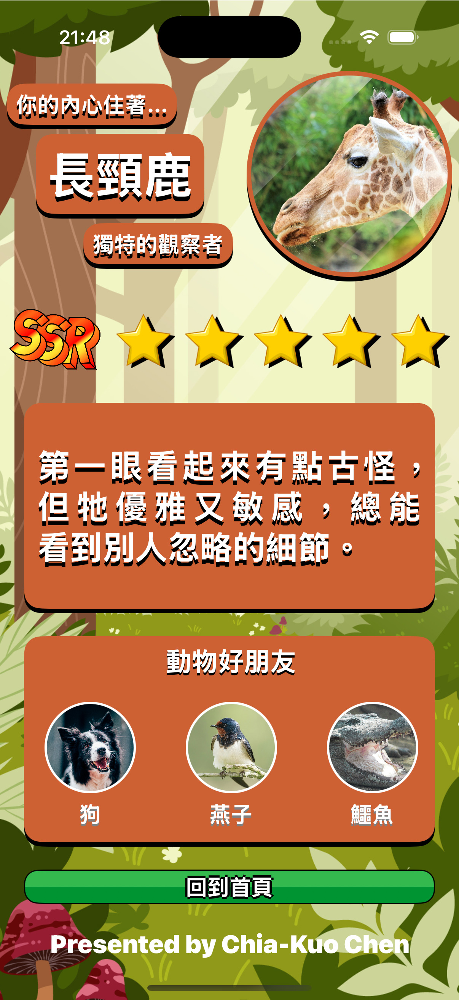
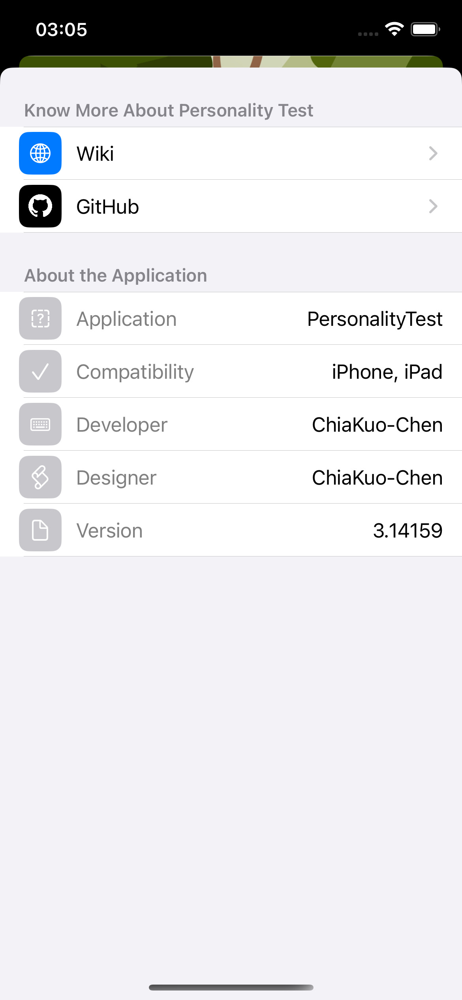
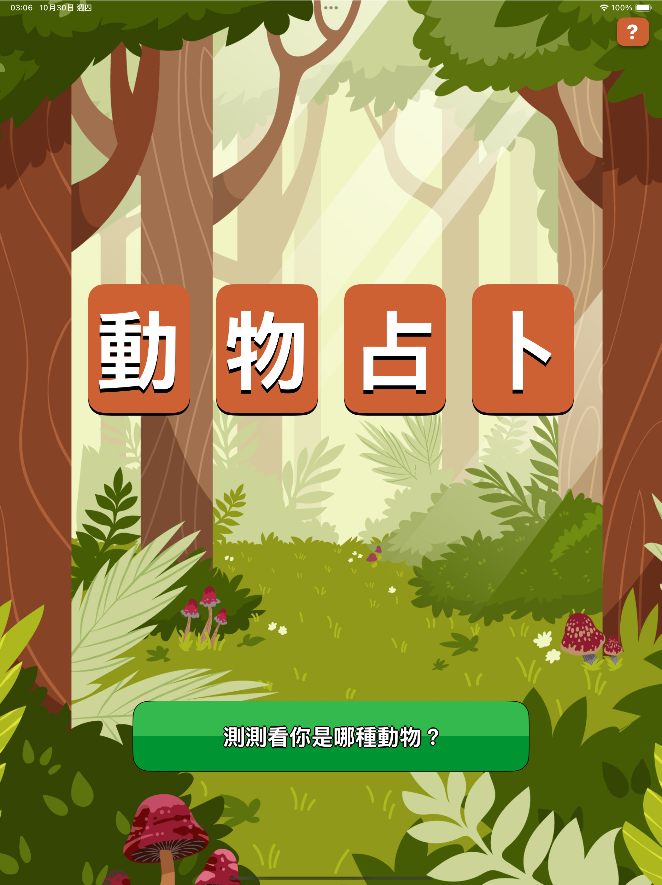
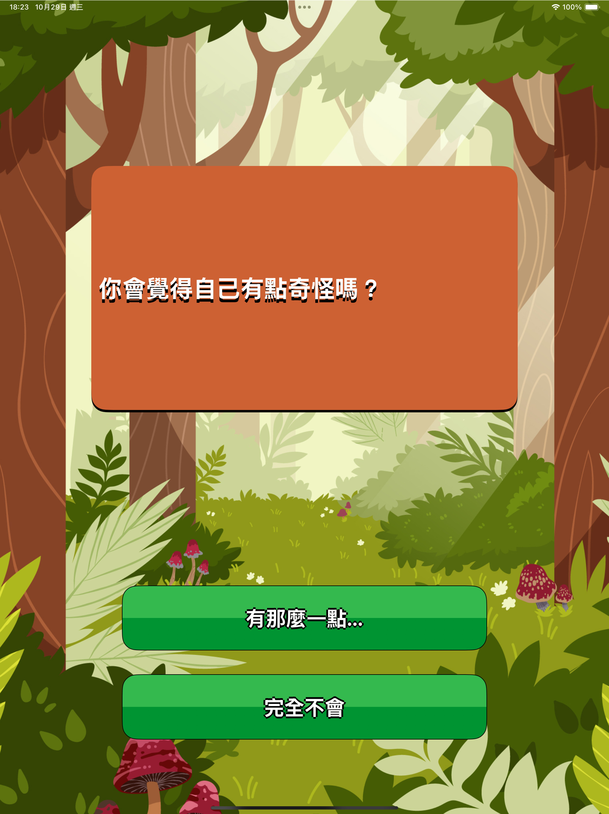
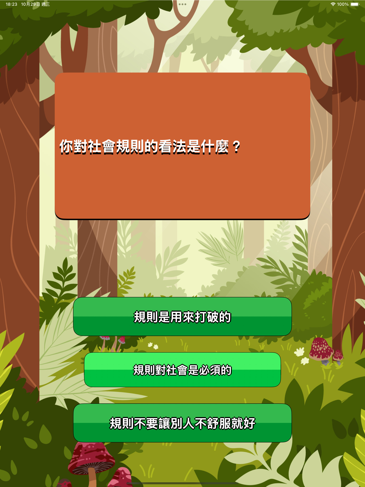
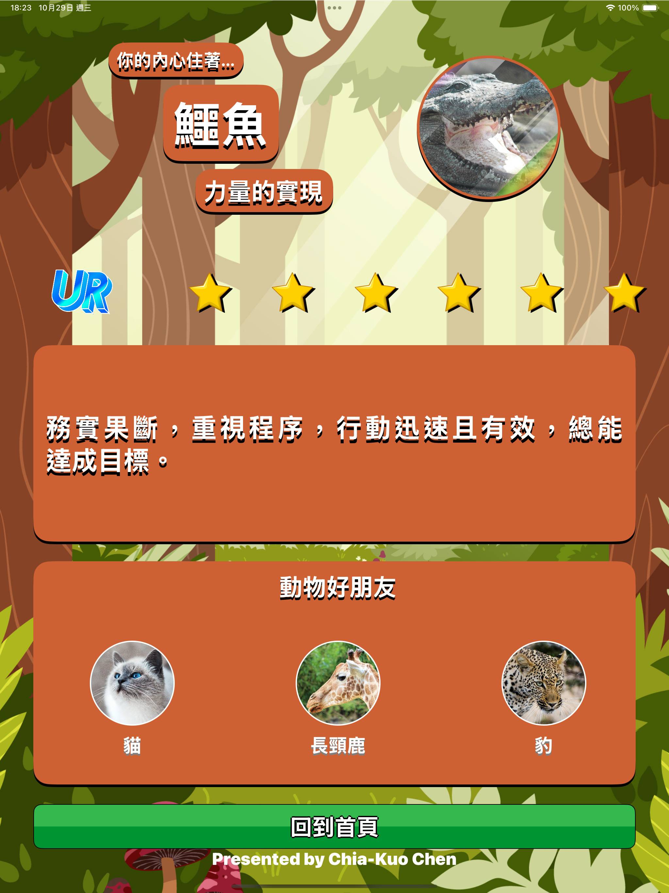

# 🐾 PersonalityTest UIKit
一款使用 UIKit 開發的動物性格測驗 App，
以問答互動的方式揭示使用者對應的「人格動物」。

## ✨ 特色
- Architecture：採用 MVC 架構，資料與視圖分離明確  
- UIKit + Auto Layout：全程程式化介面，無 Storyboard  
- Reusable Components：客製元件如 TwoColorUIButton、woodenUIView  
- Navigation Flow：以 UINavigationController 管理多層問答與結果頁  
- Data-Driven：題目與結果均由 Model 控制，易於擴充  

## 🎮 操作示意圖
<div style="display: flex; justify-content: space-between;">
  
  
  
  
  
  
</div>

Previewed on iPad Air 13 (Xcode Simulator)
<div style="display: flex; justify-content: space-between;">
  
  
  
   
  
</div>


## 🚀 How to Run
1. Clone this repository
   ```bash
   git clone https://github.com/ChiaKuo-Chen/PersonalityTest_UIKit.git)
3. Open PersonalityTest_UIKit.xcodeproj in Xcode.
4. Choose an iPhone simulator and click Run ▶️.
